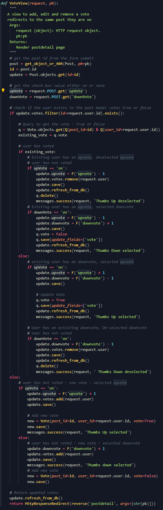
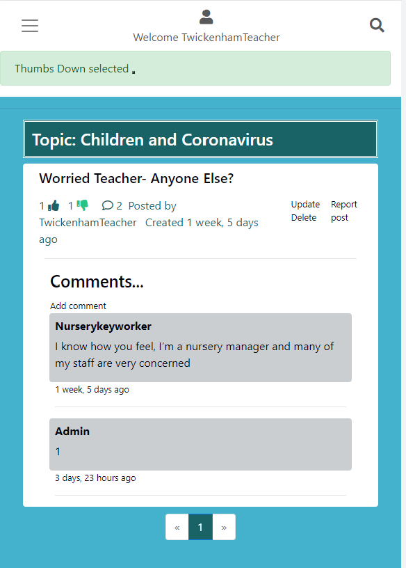
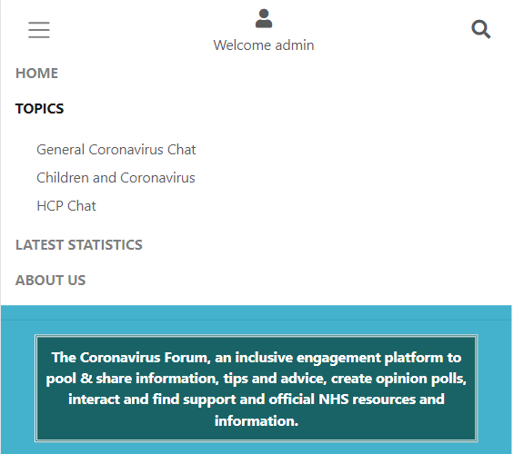

# Coronavirus forum

In early January 2020 a novel coronavirus, strain SARS-CoV-2, more commonly known as COVID-19 swept through the world. The virus began circulating in the UK in late January 2020 causing widespread panic and anxiety. With little knowledge of this virus, and concerns over the stability of the UK’s NHS resources, public health measures were incrementally introduced in early March 2020 with a nationwide lockdown amongst other restrictions.

During this time, digital transformation accelerated with tech becoming a lifeline to many people, including medical personnel. Setting aside work and education needs, people in every walk of life took to the internet to socially interact, engage, pool and share information.

The Coronavirus Forum is an inclusive engagement hub for anyone wishing to socially interact safely and anonymously, pool & share information, tips, and advice, create opinion polls, and find reputable government data relating to the COVID-19 pandemic, within a community of fellow members, all with a common interest. 

Users have the flexibility to just read content without creating an account, or they can choose to interact with other members on the site via posting, commenting, and voting on opinion polls by easily setting up a secure user account, under anonymous username, whilst independently managing their password.

**View the live site [here](https://coronavirusforum.herokuapp.com/)**

___
# Table of Contents 

1. [User Experience (UX)](#ux) 
    i.  [Strategy](#strategy) 
    ii. [Scope](#scope) 
    iii. [Structure](#Structure) 
    iv. [Skeleton and technical design](#skeleton) 
    v. [Surface](#surface) 
      
2. [Features](#features) 
    i. [Current Features](#features-current) 
    ii. [Features to implement](#features-toimplement) 

3. [Testing](#testing) 

    i. [User Stories/feature testing](#user-stories-testing) 
    ii.  [Automated testing](#automated-testing) 
    iii.  [Known issues during testing](#known-issues) 
    iv. [Validation testing  ](#validation-testing) 
    v. [Javascript testing](#js-testing) 
    vi. [Unfixed bugs](#unfixed-bugs) 
4. [Deployment](#deployment) 
5. [Technologies Used](#technology-used) 
6. [Credits](#credits) 
7. [Acknowledgements](#acknowledgements) 

# 1. User Experience (UX)  
### **Project goals:**
To create an inclusive online forum or ‘hub’ where users interact by posting messages, news, and content to hold a discussion relating to the COVID-19 pandemic.
- To enable users to post, edit and read content with referenced time stamps
- To enable users to navigate with ease with the support of specified topics
- That is intuitive for users
- That enables users to contact site admin when need arises
- That enables optional up/down voting and polling, with ability to view results in real time
- Links people to valuable NHS/Government Support
- That provides reliable and accurate UK COVID-19 case /death data from Government source 
- To enable site owner to delete posts/deactivate user accounts when necessary to ensure safeguarding and governance of talk guidelines.
- To ensure a safe environment in which to interact anonymously with secure account set-up
- To ensure a responsive site accessible to all, across multiple devices

### **Site owner goal:**
- To enable users to anonymously add/edit content onto the site with minimum intervention, to enable flexible interaction with the use of talk guidelines
- To enable users to navigate with ease and read content
- To enable registered users to up/down vote on opinion polls and read the results in real time.
- To receive user emails reporting cases of breaking talk guidelines & safeguarding concerns to respond when needed 
- To have the ability to delete posts and deactivate account users when necessary 
- To create new topics, helping users to narrow down their area of interest
- To receive user feedback via ‘contact us’ 
- To enable users to register their own accounts and manage passwords
- To provide users with a resource of up to date and accurate data on COVID-19 cases and deaths via integrated API to reliable government statistics. 
- To provide users with a quick reference to most recent posts via home page, enabling them to feel connected to current interaction and ‘hot topics’ within the community.
- A separate ‘site owner’ login to implement secure administration of the site
- To ensure users feel secure in registering and posting content, by providing privacy guidelines, talk guidelines and functionality to independently manage passwords.
- To ensure the site is fully responsive and accessible site for all users across multiple devices

### **User goals:**
- Users should find the platform intuitive and easy to use
- Ability to read/post and edit/delete content anonymously
- View latest posts in chronological order on home page and stay connected with ‘hot topics’
- Ability to up/down vote on opinion polls as a registered user and view results in real time 
- The platform should provide feedback to support users with easy navigation around the site, such as inform them when they up/down vote
- Provide time stamps to enable users to see when a post/comment was created
- The target audience of this platform is anyone, including teachers, parents, guardians, carers, and healthcare professionals who wish to socially engage.
- Find relevant info via topics and search functions.
- Ability to contact/report to site admin when required
- Register for an account/reset, change password
- To login/logout of the site
- To post under a chosen ‘username’ and keep my anonymity 
- To locate up to date COVID-19 cases/death data via reliable government statistic source
- To view talk guidelines / privacy policy / ‘about us’
- Users should be assured the data they provide whilst registering as an account user is going to be kept secure
- Generic aesthetically pleasing styling and colour palette to suit all users and accessibility 

---

## i. Strategy 

## User stories

### **1. Account management(EPIC)**

1.1 As a **site user** I can **login with my username and password** so that **I can access the sites full functionality**

1.2 As a **site user** I can **login with google** so that **I can save time and login securely**

1.3 As a **site user** I can **change my password** so that **I can stay secure**

1.4 As a **logged-in site user** I can **log out of my account** so that **other users cannot access my account**

1.5 As a **site user** I can **see the current logged-in state** so that I know if I can access logged in functionality

1.6 As a **site user** I can **register** so that **I have a role-based login and functionality of commenting and voting on posts**

1.7 As a **site user** I can **receive a welcome email** so that **I know that I have signed up correctly and feel like a valued user**

### **2. Navigation(EPIC)**

2.1 As a **site user** I can **intuitively navigate the site** so that **the layout of the site is consistent**

2.2 As a **site user** I can **search post title** so that **I can locate posts**

2.3 As a **site user** I can **click on the menu** so that **I can select topics and other pages to view**

### **3. Footer and other pages(EPIC)**

3.1 As a **site user** I can **locate the social media accounts** so that **I can follow their updates**

3.2 As a **guest/logged-in site user** I can **view the 'about us page** so that **I can understand more about the forum and its purpose**

3.3 As a **guest/logged-in site user** I can **view the 'talk guidelines page** so that **I can understand the rules**

3.4 As a **guest/logged-in site user** I can **complete a contact form so that I can provide feedback on posts to site admin where needed (report offending posts or express concern)** so that **appropriate action can be taken if needed**

3.5 As a **site user** I can **access reputable up to date data/support via a reliable and trustworthy source (such as the NHS/public health England)** so that **I am correctly informed and can stay up to date with statistics**

3.6 As a **site user**, i can **receive feedback if an API call fails, so that I receive a graceful UX and be correctly notified**

3.7 As a **guest/logged-in site user** I can **view the ‘privacy policy’** so that **I can understand the rules**

### **4. Home page(EPIC)**

4.1 As a **site user** I can **view the header and hero image** so that **I can learn more about the website and its purpose**

4.2 As a **site user** I can **click on the menu** so that **I can select topics and other pages to view**

4.3 a **guest/logged-in user** I can **view the latest 5 posts** so that **I can keep up to date with the latest posts**

### **5. Posts(EPIC)**

5.1 As a **guest user**, I can **view posts** so that **I can keep up to date with the latest posts and user comments**

5.2 As a **Site User** I can **view a paginated list of posts** so that my **screen doesn't get overpopulated with posts**

5.3 As a **guest/logged-in site user,** I can **select a topic** so I can **view posts related to the topic**

5.4 As a **guest/logged-in user** I can **view a list of posts** so that **I can select a post that interests me**

5.5 As a **guest/logged-in user** I can **click on a post** so that **I can read the full article and related comments**

5.6 As a **logged-in site user** I can **vote on a post/opinion poll, where applicable,** so that **I can take an active role in the forum if I wish**

5.7 As a **logged-in user** I can **create a new post** so that **I can post content on the site for other users to view**

5.8 As a **logged in site user** I can **edit a post (subject header /text body)** so that I can change the content if required

5.9 As a **logged-in site user** I can **leave comments on a post** so that **I can take an active role in the forum (be involved in the conversation/express my opinion)**

5.10 As a **Site User**, I can **view a paginated list of comments** so that **my screen doesn't get overpopulated with comments**

5.11 As a **Site User** I can **delete a post that I have posted** so that **I can take content off the website**

5.12 As a **user** I can **report a post to site admin** so that **I can provide feedback on posts on offending posts or express concern so that appropriate action can be taken if needed**

5.13. As a **user** who is **directed to a non-existent page or resource**, I can **receive feedback and be redirected back to the main page automatically/smoothly without having to use the browser navigation buttons so that I have a streamlined UX**

### **6. Site admin(EPIC)**

6.1 As a **site admin** I can **create, edit and delete topic title on the Django admin page** so that **I can manage the site content for the best UX**

6.2 As a **site admin** I can **create, edit and delete comments on the Django admin page** so that **I can manage the site content for the best UX**

6.3 As a **Site Admin user** I can **view, update and delete posts in django admin page** so that **I can manage content or information that might be breaching policy or upon the request of a user/poster**

6.4 As a **site admin** I can restrict/delete a user account in django admin page if the content is offending or against 'talk guidelines'** so that **I can manage the site content for the best UX**

**6.5** **As a** **site admin** **I can manage user accounts so that** **I can create new users, update their details, deactivate their status**

**6.6** **As a** **site admin** **I can create, edit and delete votes so that** **manage the votes if necessary**

### **7 Search(EPIC)**

**7.1. As a site user I can search posts by title so I can view posts that interest me**

**7.2. As a site user I can search posts by title so I can view a paginated list of posts so they don’t over populate the page**

[Table of Contents ](#home)
___
## ii. Scope 

## Strategy Trade-offs
I have rated the features on a scale of 1 to 5 in terms of importance (how important is it for the project now) and viability (how realistic is that we can implement a solution)

To achieve the strategy goals, the following features highlighted in green will be implemented to create a minimal viable product due to the timescale and technical ability. The additional features in red will be added at a further stage

 

Click here to view strategy trade offs

---

## iii. Structure  

## Website templates
I have structured the templates into the following files and have used the base template throughout the site to give a consist user experience

| Page                        | Description                                                                                    | HTML                              |
|-----------------------------|------------------------------------------------------------------------------------------------|-----------------------------------|
| **Base template**               | The base template consists of a navigation bar                                                 | base.html                         |
|                             | On smal devices consists of                                                      | mobile-top-header.html            |
|                             | a hamburger icon for the menu dropdown                                                         | & nav-menu.html                   |
|                             | a profile icon to login/out and register                                                       |                                   |
|                             | a search icon to search post titles                                                            |                                   |
|                             | On medium/large devices consists of                                                                   |                                   |
|                             | a coronavirus image on the left - user can select to go back to home page                       |                                   |
|                             | in the middle section a search bar with site navigation links below                            |                                   |
|                             | a profile icon to login/out and register on the right                                          |                                   |
|                             | The footer consists of the following links                                                     |                                   |
|                             | Talk guidelines                                                                                | talkguidelines.html               |
|                             | Privacy policy                                                                                 | privacypolicy.html                |
|                             | Contact us                                                                                     | contactus.html                    |
|                             | Social media links                                                                             |                                   |
|                             | Facebook- open in a new tab                                                                    |                                   |
|                             | Twitter- open in a new tab                                                                     |                                   |
|                             | Instagram - Open in a new tab                                                                  |                                   |
| **Navbar items**                |                                                                                                |                                   |
| Home                        | The home page consists of                                                                      | index.html                        |
|                             | A header title explaining the sites purpose                                                    |                                   |
|                             | a carousel of three images                                                                     |                                   |
|                             | 5 latest posts                                                                                 |                                   |
| Topics                      | There is a list of topics that the user can select to go to the relevant page of posts related | postlist.html                     |
| Latest statistics           | Latest data from gov.uk on coronavirus can be viewed by all users                              | govukdata.html                    |
| About us                    | A user can view the about us page                                                              | aboutus.html                      |
|                             |                                                                                                |                                   |
| **My account icon**         |                                                                                                |                                   |
| **Allauth account**         |                                                                                                |                                   |
| Sign in                     | A user can login with a valid username and password                                            | login.html                        |
| Sign out                    | A sign out link is provided under the account icon                                             | logout.html                       |
| Forgot password             | A user can reset their password                                                                | password_reset.html               |
|                             | Confirmation that an email has been sent to the user to reset password                         | password_reset_done.html          |
|                             | Page consists of a message to let the  user to change their password                           | password_reset_from_key.html      |
|                             | Allows the user to enter a new password                                                        | password_set.html                 |
|                             | Page consists of a message to let the user know password has changed                           | password_reset_from_key_done.html |
| Change password             | Page consists of a message to let the  user to change their password                           |  password_change.html                                 |
| Sign up                     | Allows a user to enter their details to sign up to the site                                     | signup.html                       |
|                             | Page consists of a message to let the  user the site has sent an email for verification        | verification_sent.html            |
|                             | Welcome email                                                                                  |                                   |
| Sign in with Google         | A user can login in with a social media login                                                  | login.html                        |
|                             | Page consists of a message to let the user know they have decided to cancel logging in         | login_cancelled.html              |
|                             | Page consists of a message to let the user know there has been an error attempting to login    | authentication_error.html         |
| **Posts**                   |                                                                                                |                                   |
| Post (add)                  | A user can add a post, by topic selection                                                      | postform.html                     |
| Post list (view)            | A user can  view a list of 5 posts filtered by topic, pagination bar                           | postlist.html                     |
| Post detail (view)          | A user can view a post                                                                         | postdetail.html                   |
| Post voting (read)          | a logged in User can view current up and down votes and vote                                   |                                   |
| Post voting (update/delete) | a logged in User can update/delete their votes if they are the owner                           |                                   |
| Report post                 | A user can report a post                                                                       | contactus.html                    |
| Update post(edit)           | A user can update a post                                                                       | updatepost.html                   |
| Delete post(delete)         | A user can delete a post                                                                       | deletepost.html                   |
| Comments(add)               | A user can add a comment                                                                       | commentform.html                  |
| Comments(read)              | A user can view created ( oldest first)                                                        | commentform.html                  |
| **404error page**           | Page consists of a message to let the user know that the url doesn't exist                     | 404error.html                     |
| **500 error page**          | Page consists of a message to let the user know that their has been an server error            | 500error.html                     |

---
## Code Structure 
The code is spilt using the Django framework into the following apps, folders and files
### Coronavirus app (main project):
-	settings.py - Settings
-	 urls.py - Website urls
### Forum app (this app contains all the functionality)
-	Admin.py  - used to display and customize the models in the Django admin panel
-	Forms.py- used to customizing fields for the form to access
-	Models.py – details all the model and every attribute 
-	Signals.py - signals allow certain senders to notify a set of receivers that some action has taken place 
-	Test_forms.py -automated testing for forms
-	Test_models.py  automated testing for models
-	Test_views.py automated testing for views
-	Views.py –views are Python functions or classes that receive a web request and return a web response. All of the logic is held
### Folders 
-	Media folder – Media files uploaded by users
-	Static folder– css, images and Javascript files
-	Staticfiles - Django. contrib. staticfiles collects static files from each applications into a single location that can easily be served in production.
-	Templates folder: 
    - all html files 
    - allauth(django authentication) 
### Files
-	manage.py: Main python file for starting the website
-	custom_storage.py: AWS Boto3 configuration
-	Procfile: To run the application
-	Requirements.txt: Containing the python libraries installed
-	Db.sqlite3 – Database for development
-	README.md: Readme documentation
-	TESTING.md: Testing documentation

[Table of Contents ](#home)

---
# Database
A relational database was used for this project.
During development SQLite DB was used and for production Postgres was used as the main database, and for deployment all data was migrated to Heroku Postgres.

## Data Schema

(vote model is a many to many field) 

---
 

## Models
The following models were created to represent the database model structure for the website
### User Model – One to many relationship - A user can have many posts
- The User model contains information about the user. It is part of the Django allauth library
- The model contains the following fields: username, password, first_name, last_name, email, is_staff, is_active, is_superuser, last_login, date_joined

 

### Topic Model – many  to one relationship – A topic can have many posts
- The topic model contains information about topic
- Below are the fields and attribute for the Topic model

Click here to view topic model

 

### Post Model 
Relationships
- a post can have many comments
- a post can have many votes
- a post can have one topic
- a post can have one user

 

- The post model contains fields about the post.
- This model captures the user and topic  to determine who made the post and the topic name.  These are foreign-keys
- Votes is a many to many field to the user so we capture the user if they have pressed a thumbs up or thumbs down 
- Below are the fields and attribute for the Post model

Click here to view post model - part 1

Click here to view post model - part 2

 

### Vote Model– many to many relationship - many votes can have many posts 
The vote model contains fields for the voting functionality - if the user has made a vote, true or false .
-	This model captures the user and post. These are foreign-keys
-	Below are the fields and attribute for the Vote model

Click here to view vote model

 

### Comment Model– many to one relationship – Many  comments can have one post
-	The comment model contains fields for the commenting functionality based on a post
-	This model captures post. This is a foreign-key
-	Below are the fields and attribute for the comment model

Click here to view comment model

 

### Definitions
-	models.ManytoManyField -A ManyToMany field - is used when a model needs to reference multiple instances of another model. E.g. A user can vote on many posts and votes can have many posts. 

- Foreign key - Foreign Key is a ORM(Object-Relational Mapper) field-to-column mapping for creating and working with relationships between tables in relational databases.
e.g.on the Post model topic is the Foreign Key to the Topic model

-	On_delete cascade – delete the rows from the child table automatically, when the rows from the parent table are deleted.  E.g. if you delete a post, all of the comments and votes are related to the post will be deleted

-	On_delete=models. PROTECT – do not delete this field in the related model

-	Default – gives a default value

-	Blank = True – allows the field to be blank, False means they cannot be blank

-	Null – store empty values as NULL in the database. Default is False

-	Max_length – max length of characters a user can enter

-	Unique – the value needs to be unique in the database

-	SlugField - A slug field is used to store and generate valid URLs for your dynamically created web pages. It will add”-“ where there are spaces in the url

-	Related name - This is used when one record of a model A is related to exactly one record of another model B.  e.g. post field in the vote model is the same as the Foreignkey so we give it a related name “vote_post”

-	Auto_now_add=True – gives the field the date when it was created

-	Class meta - l Meta is basically the inner class of your model class. Model Meta is basically used to change the behavior of your model fields like changing order options,verbose_name and lot of other options

-	Verbose name -  is a human-readable name for the field. If the verbose name isn't given, Django will automatically create it using the field's attribute name, converting underscores to spaces

-	Ordering = ascending or descending

-	__str__(self)    return str(self.title) converts the object into a string for the admin page

-	get_absolute_url(self return f”/topic/{self.post.id}- converts the object in to a url string  “topic/post/1” for example

[Table of Contents ](#home)
---

## iv. Skeleton / Technical design  
I used Balsamiq to create wireframes for my project in order to plan out the layout of the interface, navigation and information design of the site on desktop, tablets and mobile devices.
Page | Wireframe | 
------------ | ------------- 
Home page|[Mobile](readme/docs/images/wireframes/home.png)
Home page with navbar|[Desktop/Tablet](readme/docs/images/wireframes/home_mediumplus_devices.png)
Navbar|[Mobile](readme/docs/images/wireframes/navbar_menu.png)
Search |[Desktop/Tablet/Mobile](readme/docs/images/wireframes/search.png)
Flash messages |[Desktop/Tablet/Mobile](readme/docs/images/wireframes/alert_flash_messages.png)
Sign in page |[Desktop/Tablet/Mobile](readme/docs/images/wireframes/account_login.png)
Sign up page |[Desktop/Tablet/Mobile](readme/docs/images/wireframes/account_register.png)
View list of posts page |[Desktop/Tablet/Mobile](readme/docs/images/wireframes/view_post_list.png)
New post page|[Desktop/Tablet/Mobile](readme/docs/images/wireframes/new_post.png)
New comment page |[Desktop/Tablet/Mobile](readme/docs/images/wireframes/new_comment.png)
Links for CRUD page|[Desktop/Tablet/Mobile](readme/docs/images/wireframes/read_update_delete_post,_add_comment_vote.png)
API page |[Desktop/Tablet/Mobile](readme/docs/images/wireframes/api_page.png)
Privacy policy page|[Desktop/Tablet/Mobile](readme/docs/images/wireframes/privacy_policy.png)
Talk guide lines page |[Desktop/Tablet/Mobile](readme/docs/images/wireframes/talkguide_lines.png)
About us page |[Desktop/Tablet/Mobile](readme/docs/images/wireframes/about.png)

Other page are designed off the base.html
___
## Business logic

### **Voting logic**

Click here to view voting logic diagram

- Users can vote on a post giving a thumbs up or thumbs down ( a user can only choose one per post)

- On the template there are hidden checkboxes linked to images of the thumbs

- Javascript listens out for when a user clicks on the checkboxes and then submits the form when they do.  This triggers a post request and the logic

#### **Backend**
- To set the number of votes for up thumbs and down thumbs in the database
- See below snippet of the code which I have commented for explanation purposes

Click here to view logic

___
### **Logic of the activating and deactivating the  thumb colours**

#### **Back end**
We have three states that the user can have
1.	User has not voted at all
2.	User has voted with uplike
3.	User has voted with downlike

We apply two 
1.	whether the user has voted (“voted” variable set true or false)
2.	how they have voted “upvoted” variable set to true or false (If they have downvoted then “upvote” will be false
 

Click here to view logic

### **Explanation**
The statement  the values of voted and upvoted. So the if statement will trigger only if voted is True and upvoted is False. In all other cases, the else-bit will be executed. 

If the user hasn't voted, voted will be set to False and upvoted  to None. 

If the user and post matches then we get the Vote object that matches the user and the post. 
and then assign “upvoted” to the vote field of that object and “voted” to true 

Votes in the post is a ManyToMany field (of users). 
“.all()” to convert post.votes(FK) in to a list 
 “in”  if the user is in that list. 
.
The values of voted and upvoted are passed in the context dictionary 
 

#### **Front end template** (applying the logic to the thumb colour)
- Upthumb
    - if voted and upvoted is true , highlight the upthumb else apply the original colour

- Downthumb
    - if voted is true and upvoted is false highlight the down thumb else apply the original colour

---
## v. Surface  
My goal is to build a platform inclusive and accessible to everyone, so therefore it should be aesthetically pleasing in a generic style.

### **Color Palette**
I selected a coronavirus image, one that has become recognisable and is commonly associated with COVID-19 and uploaded it onto a colour palette website. The colour palette website provided colour palette suggestions, from which I chose the defined colour palette below. 

Click here to view the coronavirus image 

 

### **Typography**

The following font Roboto have been selected to ensure the text is easy to read, add value to the text, and invoke user to perceive a positive emotion from the text. The fonts chosen are generic and therefore should appeal to any demographic/user. It is rated as Google's best font. I chose font Lato as a fallback

### **Imagery**
Likewise for the image carousel I selected imagery aligned to the theme of COVID-19, plus my colour palette to make the home page visually pleasing and eye catching whilst ensuring the styling throughout the platform is consistent
Please refer to further details in credits section for specific images used within the project

Click here to view carousel image 1

 

Click here to view carousel image 2

 

Click here to view  carousel image 3

 

Click here to view coronavirus logo

 

[Table of Contents ](#home)

---

# 2. Features  

## Existing features

### **Feature 1 Navigation bar**

Navigation bar is featured on all pages at the top of the screen 
This section will allow the user to easily navigate from page to page across all devices without having to revert back to the previous page via 'back button' 

**Small screen devices **

Click here to view image 

 

**Left**

Click here to view image 

- Navigation icon
- User can then select from the dropdown from the menu “Home”, “Topics”, “Latest Statistics” ,“About Us”

**Center** 
**Not logged in user**

Click here to view image 

- Account icon
- Under icon “Sign in”
- User can then select from the dropdown menu - “Sign up” or “Sign in”

**Logged in user**

Click here to view image 

- Account icon
- Under icon  - “Welcome (username)” e.g. “Welcome Admin”
- User can then select from the dropdown menu "Change password, “Logout” 

**Right**

Click here to view image 

- Search icon
- User can then select the search icon 
- Search bar and submit button appear under the navigation menu

 

**Medium and larger screen devices** 

Click here to view image 

 

**Left**

Click here to view image 

- A coronavirus icon
- User can then select the icon and will be - redirect to home page

**Center**  

Click here to view image 

- Search bar and submit button
- Under the search bar Navigation link
 -“Home”, “Topics”, “Latest Statistics” ,“About Us” 

 

**Right** 

**Not logged in user**

Click here to view image 

- Account icon
- Under icon “Sign in"
- User can then select from the dropdown menu “Sign up” or “Sign in”

**Logged in user** 

Click here to view image 

- Account icon
- Under icon  - “Welcome (username)” e.g. “Welcome Admin”
- User can then select from the dropdown menu "Change password", “Logout” 

### Access
| No. | Features |Not logged in | Logged in | Admin |
| ------ | ------ | ------ | ------ | ------ |
| 1 | Navigation bar| Yes| Yes|Yes|

### **User Stories related to feature 1**  
2.1 As a site user I can intuitively navigate the site so that the layout of the site is consistent 
2.2 As a site user I can search post title so that I can locate posts 
2.3 As a site user I can click on the menu so that I can select topics and other pages to view 

___
### **Feature 2 Footer**
The footer is displayed at the bottom of the page, Talk Guidelines, Privacy Policy, Contact Us, plus the social media links will all open to a new tab to allow easy navigation 
The footer is valuable to the user as it provides important navigation options and encourages them to keep connected with site admin, governance and social media 
**Responsive on all devices**  

Click here to view image - small devices

 

Click here to view image - medium and large devices 

 

Links to the following  
- Talk guidelines 
- Privacy policy 
- Contact us
- Facebook
- Twitter
- Instagram 

### Access
| No. | Features |Not logged in | Logged in | Admin |
| ------ | ------ | ------ | ------ | ------ |
| 2 | Footer| Yes| Yes|Yes|

### **User Stories related to feature 2**  
3.1 As a site user I can locate the social media accounts so that I can follow their updates 
3.2 As a guest/logged-in site user I can view the 'about us page so that I can understand more about the forum and its purpose 
3.3 As a guest/logged-in site user I can view the 'talk guidelines page so that I can understand the rules 
3.4 As a guest/logged-in site user I can complete a contact form so that I can provide feedback on posts to site admin where needed (report offending posts or express concern) so that appropriate action can be taken if needed 

___
### **Feature 3 Home page**
This section introduces the user to the Coronavirus forum with a carousel of images to complement styling and the five most recent posts listed as quick reference, to support users in staying connected with new posts and 'hot topics' 

**Responsive on all devices**  

Click here to view image - small devices

 

Click here to view image - medium and large devices 

 

Click here to view image - flash messaging 

 

The homepage consists 
- Flash message section appears
- Header title explaining the site
- Carousel of three images
- Title – Latest post
- 5 latest posts 
- Post title, number of comments, posted by and created time fields displayed
- Navigation bar for users to view other pages
 
### Access
| No. | Features |Not logged in | Logged in | Admin |
| ------ | ------ | ------ | ------ | ------ |
| 3 | Home page| Yes| Yes|Yes|

### **User Stories related to feature 3**  
4.1 As a site user I can view the header and hero image so that I can learn more about the website and its purpose 
4.2 As a site user I can click on the menu so that I can select topics and other pages to view 
4.3 As guest/logged-in user I can view the latest 5 posts so that I can keep up to date with the latest posts 

___
### **Feature 4 Account Management**
This section allows the user to independently register for an account, sign in/out and change their password so they can access the forum for more functionality 
**Responsive on all devices**  
## Sign in 

- As a registered user/admin can log into the site using their username or email address and password

Click here to view image - small devices

Click here to view image - medium and large devices 

 

- Both fields are required

Click here to view image - username required 

Click here to view image password required 

 

- If the user enters both fields correctly a success message ia displayed “successfully sign is as (username)”

Click here to view image  

 

- Under the account icon, the text will change from sign in to - sign out

Click here to view image  

 

___

## Sign in with Google

- As a registered google user can log into the site using their username or email address and password

Click here to view google sign in button

 

Click here to view google sign in via google page

 

Click here to view choose a google account page 

 

Click here to view logged in image 

 

___

## Forgot password on the sign page

- As a registered user, the user can go to the forgot password to reset their password

Click here to view image  

 

- The user will be required  to enter a registered email address

Click here to view image  

 

- The user will be sent a reset password email and click on the link

Click here to view image  

 

- The user will be able to reset password 

Click here to view image  

 

- User will have to entered their password twice

Click here to view image  

 

- Success  message “password successfully changed” is displayed
 

Click here to view image  

 

___

## Change password

- As a registered user, the user can go to the change password to change their password

Click here to view image  

 

- The user will be required  to enter a registered email address

Click here to view image  

 

- The user will be sent a reset password email and click on the link

Click here to view image  

 

- The user will be able to reset password 

Click here to view image  

 

- User will have to entered their password twice

Click here to view image  

 

- Success  message “password successfully changed” is displayed

Click here to view image  

 

___

### Sign out

- As a signed in user, the user can sign out. 

Click here to view image of sign out link

Click here to view image of sign out page

 

- A success message will appear “you have signed out”

Click here to view image of sign out page

 

- Under the account icon, the text will change from username to sign in

Click here to view image of sign out page

 

___

### Sign up

- As a guest user, they can register for an account

Click here to view image of sign up page

 

- The user must enter a valid email address, username, password(twice) 

Click here to view image

 

- User is required to verify your email address
- Success message " Confirmation email sent to ckcabs@hotmail.com

Click here to view image

 

- Welcome email is sent to user

Click here to view image

 

- User is required to  confirm e-mail

Click here to view image

 

- User is required to  confirm e-mail address

Click here to view image

 

- Success message – you have confirmed (username)

Click here to view image

 

- Admin users can create, edit,delete, activate and de-active user profiles via the admin panel

Click here to view image -edit user details including activate and de-active

Click here to view image -Create user

Click here to view image -Delete user

 

### Access
| No. | Features |Not logged in | Logged in | Admin |
| ------ | ------ | ------ | ------ | ------ |
| 4 | Account Management| | ||
|  | Sign in| Yes| No|Yes|
|  | Sign out| No| Yes|Yes|
|  | Sign up| Yes| No|No|
|  | Welcome email| Yes| No|No|
|  | Forgot password| Yes| No|No|
|  | Change password| No| Yes|Yes|
|  | User account management| No| No|Yes|

### **User Stories related to feature 4**  
1.1 As a site user I can login with my username and password so that I can access the sites full functionality  
1.2 As a site user I can login with google so that I can save time and login securely 
1.3 As a site user I can change my password so that I can stay secure 
1.4 As a logged-in site user I can log out of my account so that other users cannot access my account 
1.5 As a site user I can see the current logged-in state so that I know if I can access logged in functionality 
1.6 As a site user I can register so that I have a role-based login and functionality of commenting and voting on posts 
1.7 As a site user I can receive a welcome email so that I know that I have signed up correctly and feel like a valued user 
6.4 As a site admin I can restrict/delete a user account in django admin page if the content is offending or against 'talk guidelines' so that I can manage the site content for the best UX 
6.5 As a site admin I can manage user accounts so that I can create new users, update their details, deactivate their status 

___
### **Feature 5 Posts**

The user will see value of signing up to be able to create/edit/delete posts in order to be an active user of the forum 

**Responsive on all devices**  

**Post list** 

- All users can view a list of posts by topic
- Header title displayed “topic name” 

Click here to view image  

 

- **Logged in** users can add a new post
- A link “ start a new post within this topic” is display  

Click here to view image  

 

- A list of posts is displayed in ascending order and paginated by 5 
- Each Post consists of  
    - Title
    - “VOTE” will be displayed if voting has been enabled,
    - number of comments, 
    - who created the post
    - when it was created

Click here to view image  

 

- A **logged in** user can start a new post 
    - Header title displayed “Add a new post”
    - Topic is displayed
    - Talk guidelines link is displayed for users to view
    - User can enter post details
        - Title (required)
        - Body
        - Upload an image
        - Enable voting
        - Select Submit post

Click here to view image  

 

- Success message “Post submitted”

Click here to view image  

 

**Post detail** 

- A **not logged/logged in** in user can view a post in detail
    - The topic will be displayed in the header
    - The post will be displayed under
    - Post contains
        - Title
	    - If voting is enabled - Up and down vote thumbs and number of votes will be displayed 
        - Logged users can vote up or down and change their vote
        - Not logged in users - A link to sign in if the user would like to vote
        - who created the post
        - time when the post was created	
        - Update, delete and report post link is displayed if the user is the owner of the post else no links will be displayed
        - Image will display if there is one to display
        - Users comments will be displayed in descending order paginated by 5
        

Click here to view image of a post-not logged in

Click here to view image of a post -logged in

 

- If a user encounters an error, the relevant error page is displayed (404 )

Click here to view image

 

### An owner of the post can **“Update”** their post

- “Update post”** is displayed in the header
- The fields are displayed with the post details. 
- User can edit the fields 
- Success message displayed “post updated”

Click here to view image -update post

Click here to view image - updated post - flash message

 

### An owner of the post can **“Delete”** their post
- Delete post is displayed in the header
- Post title is displayed and a question to whether the user is sure to delete the post
- User can click Cancel to go back to the post Or Delete post to delete the post from the database

Click here to view image of delete post page

- If they click "delete" post , a success message displayed “Post deleted”

Click here to view image of delete post page - success message

 

### A signed in user can  **“Report post”** 
See feature 7

### Admin users can add, edit and delete a post via the admin panel

Click here to view image - Create a post 

Click here to view image - Edit  a post 

Click here to view image - Delete a post 

 

### Access
| No. | Features |Not logged in | Logged in | Admin |
| ------ | ------ | ------ | ------ | ------ |
| 5 | Post| | ||
|  | Create| No| Yes|Yes|
|  | Read| Yes| Yes|Yes|
|  | Edit| No| Yes-if owner|Yes|
|  | Delete| No| Yes-if owner|Yes|

### **User Stories related to feature 5**  
5.1 As a guest user, I can view posts so that I can keep up to date with the latest posts and user comments 
5.2 As a Site User I can view a paginated list of posts so that my screen doesn't get overpopulated with posts 
5.3 As a guest/logged-in site user, I can select a topic so I can view posts related to the topic 
5.4 As a guest/logged-in user I can view a list of posts so that I can select a post that interests me 

5.5 As a guest/logged-in user I can click on a post so that I can read the full article and related comments 
5.6 As a logged-in site user I can vote on a post/opinion poll, where applicable, so that I can take an active role in the forum if I wish 
5.7 As a logged-in user I can create a new post so that I can post content on the site for other users to view 
5.8 As a logged in site user I can edit a post (subject header /text body) so that I can change the content if required 
5.9 As a logged-in site user I can leave comments on a post so that I can take an active role in the forum (be involved in the conversation/express my opinion) 
5.10 As a Site User, I can view a paginated list of comments so that my screen doesn't get overpopulated with comments 
5.11 As a Site User I can delete a post that I have posted so that I can take content off the website 
5.12 As a user I can report a post to site admin so that I can provide feedback on posts on offending posts or express concern so that appropriate action can be taken if needed 
5.13. As a user who is directed to a non-existent page or resource, I can receive feedback and be redirected back to the main page automatically/smoothly without having to use the browser navigation buttons so that I have a streamlined UX 
6.3 As a Site Admin user I can view, update and delete posts in django admin page so that I can manage content or information that might be breaching policy or upon the request of a user/poster 

___
### **Feature 6 - Voting**
The user will see value of signing up to contribute to opinion polls, by voting on a post and being an active user of the forum 

**Responsive on all devices**  

Click here to view image - Voting enabled in post list 

 

**All users** can view number of votes 
If voting is enabled - Up and down vote thumbs and number of votes will be displayed 

Click here to view image  

 

**Not logged in users**  
 - Not logged in users will not be able to vote
A "sign in" link is displayed, if the user would like to vote 

Click here to view image  

 

**User is logged in** 
Logged in users can -
- Add a new vote
- Change the vote ( if they are the owner of the vote)
- Remove the vote ( if they are the owner of the vote)

Click here to view image -Add a vote 

Click here to view image - change a vote  

Click here to view image - remove vote  

 

### Access
| No. | Features |Not logged in | Logged in | Admin |
| ------ | ------ | ------ | ------ | ------ |
| 6 | Voting -up and down| | ||
|  | Read| Yes| Yes|Yes|
|  | Edit| No| Yes-if owner|Yes|

### **User Stories related to feature 6**  
5.6 As a logged-in site user I can vote on a post/opinion poll, where applicable, so that I can take an active role in the forum if I wish and contribute to opinion poll results 
6.6 As a site admin I can create, edit and delete votes so that manage the votes if necessary 

___
### **Feature 7 -Report post**
The user will see value of signing up and be able to report a post  
**Responsive on all devices**  

**Signed in users**
- A signed in user can report a post 

Click here to view image - Report post link 

Click here to view image - Contact us form 

Click here to view image - subject pre populated, email address required 

Click here to view image - message required 

Click here to view image - Email sent, Flash message and message to thank the user 

Click here to view image - email received by admin 

**Not signed in users** 
- A not signed in user can not report a post

 

Click here to view image 

 

### Access
| No. | Features |Not logged in | Logged in | Admin |
| ------ | ------ | ------ | ------ | ------ |
| 7 | Report post|No |Yes |Yes|
|  | Read| Yes| Yes|Yes| 

### **User Stories related to feature 7**  
5.12 As a user I can report a post to site admin so that I can provide feedback on posts on offending posts or express concern so that appropriate action can be taken if needed
___

### **Feature 8 – Comments**
The user will see value of signing up to be able to add new comment on a post and potentially interact with other users  

**Responsive on all devices**  

Click here to view image of comment section (logged in)

 

**Not signed in users** 
- If no comments are made
    - No comments yet.. displayed
    - "Add one" link NOT displayed 
    - "Sign in to make a comment" displayed
     

Click here to view image 

 

**Signed in users**
- If no comments are made
    - A signed in user can add a new comment

Click here to view image 

 

- User clicks on “add one” 
    - Header title displayed “add new comment”
    - Post title displayed
    - Number of comments displayed, who created the post and when it was created  
    - Talk guide lines link is displayed for users to view
    - User can enter their comment in the field and click add comment

Click here to view image 

 

- Success message “Comment added”
- Redirected to the post, comment will be at the bottom of the list 

Click here to view image 

 

- Admin users can edit and delete comments via the admin panel

Click here to view image - Create comment 

Click here to view image - Edit comment 

Click here to view image - Delete comment 

 

### Access
| No. | Features |Not logged in | Logged in | Admin |
| ------ | ------ | ------ | ------ | ------ |
| 8 | Comments| |||
|  | Create| No| Yes|Yes|
|  | Read| Yes| Yes|Yes|
|  | Edit| No| No|Yes|
|  | Delete| No| No|Yes|

### **User Stories related to feature 8**  
5.9 As a logged-in site user I can leave comments on a post so that I can take an active role in the forum (be involved in the conversation/express my opinion) 
5.10 As a Site User, I can view a paginated list of comments so that my screen doesn't get overpopulated with comments 
6.2 As a site admin I can create, edit and delete comments on the Django admin page so that I can manage the site content for the best UX 

___
### **Feature 9 –Topics**
All users will see value of being able view posts by topic, ensuring a relevant UX  

Click here to view image

 

- Selecting a topic allows the user to display a list of posts filtered by topic chosen

Click here to view image

 

- Admin users can create, edit and delete topics via the admin panel

Click here to view image- create topic

Click here to view image- edit topic

Click here to view image- delete topic

 

### Access
| No. | Features |Not logged in | Logged in | Admin |
| ------ | ------ | ------ | ------ | ------ |
| 9 | Topics| |||
|  | Create| No| No|Yes|
|  | Read| Yes| Yes|Yes|
|  | Edit| No| No|Yes|
|  | Delete| No| No|Yes|

### **User Stories related to feature 9**  
5.3 As a guest/logged-in site user, I can select a topic so I can view posts related to the topic 
5.4 As a guest/logged-in user I can view a list of posts so that I can select a post that interests me 
6.1 As a site admin I can create, edit and delete topic title on the Django admin page so that I can manage the site content for the best UX 

___
### **Feature 10 –Latest statistics**
All users will see value in accessing up to date and reliable case/death statistics integrated for quick reference from the Government website API 
**Responsive on all devices**  

All users can access this page and functionality 

- Redirected to government data page
- Header title displayed “The official UK government data on coronavirus (COVID-19)” 
- A date picker is displayed, the user can only select the dates available
- A message below to select a date from the past 200 days to see the statistics

Click here to view image

 
- The user selects a date
- Daily cases, cumulative cases, daily deaths and cumulative deaths are displayed

Click here to view image

 

- If a user encounters an error, the relevant error page is displayed (500)

Click here to view image

 

### Access
| No. | Features |Not logged in | Logged in | Admin |
| ------ | ------ | ------ | ------ | ------ |
| 10 |Latest statistics| Yes| Yes|Yes|

### **User Stories related to feature 10**  

3.5 As a site user I can access reputable up to date data/support via a reliable and trustworthy source (such as the NHS/public health England) so that I am correctly informed and can stay up to date with statistics 
3.6 As a site user, i can receive feedback if an API call fails, so that I receive a graceful UX and be correctly notified 

___
### **Feature 11 –About us**
All users will see value of reading more about the forum and accessing links to NHS/Government resource websites  

**Responsive on all devices**  
- Redirected to about us page
- Header title displayed “About us” 
- Text displayed

Click here to view image

 

### Access
| No. | Features |Not logged in | Logged in | Admin |
| ------ | ------ | ------ | ------ | ------ |
| 11 |About us| Yes| Yes|Yes|

### **User Stories related to feature 11**  
3.2 As a guest/logged-in site user I can view the 'about us page so that I can understand more about the forum and its purpose

___
### **Feature 12 –Contact us**
All users will see value of being able to contact the forum if they have any question or wish to share feedback 

**Responsive on all devices**  
- Redirected to contact us page
- Header title displayed “Contact us” 

Click here to view image

 

- Form displayed, all fields are required

Click here to view image - subject required

Click here to view image- email required

Click here to view image- message required

 

- Success message displayed “Email sent successfully”
- Redirected to contact form with a thank you message

Click here to view image - Flash message 

 

### Access
| No. | Features |Not logged in | Logged in | Admin |
| ------ | ------ | ------ | ------ | ------ |
| 12 |Contact us| Yes| Yes|Yes|

### **User Stories related to feature 12**  
3.4 As a guest/logged-in site user I can complete a contact form so that I can provide feedback on posts to site admin where needed (report offending posts or express concern) so that appropriate action can be taken if needed 
___
### **Feature 13 -Talk guidelines**
All users will see value of being able to view the guidelines so they can abide by community governance 

**Responsive on all devices**  

- Redirected to talk guidelines page
- Header title displayed “talk guide lines” 
- Guidelines displayed

Click here to view image

 

### Access
| No. | Features |Not logged in | Logged in | Admin |
| ------ | ------ | ------ | ------ | ------ |
| 13 |Talk guidelines| Yes| Yes|Yes|

### **User Stories related to feature 13**  

3.3 As a guest/logged-in site user I can view the 'talk guidelines page so that I can understand the rules 

___
### **Feature 14 - Privacy policy**
All users will see value of being able to read the privacy policy to educate themselves re how the site is managing their data 
**Responsive on all devices**  

- Redirected to Privacy policy page
- Header title displayed “Privacy policy” 
- Policy displayed

Click here to view image

 

### Access
| No. | Features |Not logged in | Logged in | Admin |
| ------ | ------ | ------ | ------ | ------ |
| 14 |Privacy policy| Yes| Yes|Yes|

### **User Stories related to feature 14**  

3.7 As a guest/logged-in site user I can view the ‘privacy policy’ so that I can understand the rules 
___
### **Feature 15 - Search**
All users will be able to search for a keyword in a post title to quickly locate and view posts they are interested in 
**Responsive on all devices**  
- Redirected to post list page
- Header title displayed “Search Post” 
- Post list displayed paginated by 5

Click here to view image

 

### Access
| No. | Features |Not logged in | Logged in | Admin |
| ------ | ------ | ------ | ------ | ------ |
| 15|Search| Yes| Yes|Yes|

### **User Stories related to feature 15**  
7.1. As a site user I can search posts by title so I can view posts that interest me 
7.2. As a site user I can search posts by title so I can view a paginated list of posts  so they don’t over populate the page 

## ii. Features remaining to implement (long term objectives): 
- Edit / delete comments
- Direct message
- Account profile with user history of posts
- Reply to comments

[Table of Contents ](#home)

___

# 3. Testing  

## i. User stories testing  

User stories are tested with the current features. All user stories passed the tests.

[Click on the link to go to user stories testing ](https://github.com/ccarabine/coronavirus/blob/main/readme/docs/user-story_testing.md)

---
## ii. Automated testing 

[Click on the link to go to automated testing](https://github.com/ccarabine/coronavirus/blob/main/readme/docs/automated_testing.md)

---
## iii. Known issues during development and testing 

[Click on the link to go to Known issues during development and testing](https://github.com/ccarabine/coronavirus/blob/main/readme/docs/known_issues.md)

---
## iv. Validation testing:
[Click on the link to go to Validation testing](https://github.com/ccarabine/coronavirus/blob/main/readme/docs/validation_testing.md)

___

## v. Javascript testing:
[Click on the link to go to Javascript testing](https://github.com/ccarabine/coronavirus/blob/main/readme/docs/javascript_testing.md)

___
**I have disabled the following false errors:**

script.js

/*global bootstrap:false*/
/*jshint esversion:6*/

database url # nopep8

___

## vi. Unfixed Bugs  
No unfixed bugs
___

# 4. Deployment  
[Click on the link to go to deployment ](https://github.com/ccarabine/payroll/blob/main/readme/docs/deployment.md)

___

# 5. Technologies Used   
## Languages

- Django (https://www.djangoproject.com/)
    -   This project was created using the Django framework, the back-end logic and the means to run/view the Website.
    -   The Django unit test library was used for unit tests
-   HTML(https://en.wikipedia.org/wiki/HTML)
    -   This project uses HTML as the main language used to complete the structure of the Website.
-   CSS (https://en.wikipedia.org/wiki/CSS)
    - This project uses custom written CSS to style the Website.
- JavaScript (https://www.javascript.com/)
    - JavaScript is used all scripting on the site

- Python 3 - this projects core was created using Python, the back-end logic and the means to run/view the Website.
    - Python Modules used (These can be found in the requirements.txt project file):
    - asgiref==3.4.1 (Support for Python asynchronous web apps and servers to communicate with each other)
    - backports.zoneinfo==0.2.1 (timezone formatter)
    - black==21.12b0(code formatter)
    -	boto3==1.20.27 (Python SDK for AWS)
    -	botocore==1.23.27  (Python SDK for AWS)
    -	click==8.0.3(beautiful command line interfaces )
    -	dj-database-url==0.5.0  (Support for DATABASE_URL environment variable)
    -	Django==4.0.1 (Web framework)
    -	django-allauth==0.47.0 (Web framework authentication)
    -	django-crispy-forms==1.13.0(Django rendering of forms)
    -	django-formtools==2.3(high-level abstractions for Django forms)
    -	django-storages==1.12.3 (Django storage backend for AWS S3)
    -	django-summernote==0.8.20.0(WYSIWYG editor)
    -	gunicorn==20.1.0(Python WSGI Http server)
    -	jmespath==0.10.0(Full suite of data driven testcase)
    -	oauthlib==3.1.1(Framework for oauth1 and oauth2)
    -	pathspec==0.9.0
    -	Pillow==9.0.0 (Imaging library)
    -	psycopg2==2.9.3 (Postgres adapter)
    -	PyJWT==2.3.0(encode and decode JSON Web Tokens)
    -	python3-openid==3.2.0(Support for the OpenID decentralized identity system)
    -	requests-oauthlib==1.3.0(Authentication support for Requests)
    -	s3transfer==0.5.0 (Python library for managing Amazon S3 transfers)
    -	sqlparse==0.4.2(Non-validating SQL parser for Python)
    -	tomli==1.2.3
    -	tzdata==2021.5
    -	whitenoise==5.3.0

I have also utilised the following applications, platforms and libraries:
-	Bootstrap (https://getbootstrap.com/readme/docs/4.0)
    - The Bootstrap framework was used through the website for layout and responsiveness.
- GitPod: (https://gitpod.io/)
    - I used GitPod as the IDE for this project and Git has been used for Version Control.
- GitHub: (https://github.com/)
    - GitHub has been used to create a repository to host the project and receive updated commits from GitPod.
- Heroku: (https://id.heroku.com/login)
    - Used to deploy the application.
- Google Cloud Platform: (https://cloud.google.com/)
    - Google Cloud Platform has been used for google login
- Amazon s3 buckets: (https://aws.amazon.com/)
    - AWS S3's Storage Solutions

- Postgres (https://www.postgresql.org/)
    - The deployed project on Heroku uses a Postgres database
- SQLLite (https://www.sqlite.org/index.html)
    - The database uses in local development was a SQLLite database

- HTML Markup Validation Service (https://validator.w3.org/)   
    - HTML validation service for validation the css in the project 
- CSS Validation Service (https://jigsaw.w3.org/css-validator/)
   - CSS validation service for validation the css in the project 
- JSHint (https://jshint.com/)
  - For javascript code quality 
- PEP8 Online Validation Service: (https://www.python.org)
    - The PEP8 Online Validation Service was used to validate the Python document for this project and to identify any issues with the code.
- Unittest (https://docs.djangoproject.com/en/3.2/topics/testing/overview/)
    - For Python unit testing

- Sparkles chrome extension: used to debug a width overflow issue.  It puts borders around each element
- Google Chrome Developer Tools
    - Google chromes built in developer tools are used to inspect page elements and help debug issues with the site layout and test different CSS styles.

- Lucid Chart: Lucid Chart was used to create flowcharts
- Balsamiq Wireframes(https://balsamiq.com/)
    - This was used to create wireframes for 'The Skeleton Plane' stage of UX design.
- SQL DRAW https://drawsql.app/– Database diagram editor
- Am I Responsive: (http://ami.responsivedesign.is/)
    - Multi Device Website Mockup Generator was used to create the Mock up image in this README

- Google Fonts:(https://fonts.google.com/)
- Font Awesome(https://fontawesome.com/)
    - All the Icons displayed throughout the website are Font Awesome icons.
- Colour generator from image: (https://coolors.co/)

___
Python Libraries
I have used these third-party libraries for this project for the following reasons:

- request
    - Django uses request and response objects to pass state through the system.
    - When a page is requested, Django creates an HttpRequest object that contains metadata about the request. Then Django loads the appropriate view, passing the HttpRequest as the first argument to the view function. Each view is responsible for returning an HttpResponse object.

- django 
    - from django.contrib import messages - used for flash messages
    - from django.contrib.auth.decorators import login_required - used to restrict access to methods/functions(backend) in the front end
    - from django.contrib.messages.views import SuccessMessageMixin - used for class based views -flash messages
    - from django.core.paginator import Paginator - used for pagination functionality
    - from django.core.mail import send_mail - used for sending emails
    - from django.db.models import F, Q Q is used to filter an object
        - Using F() objects can directly reference the values ​​of model fields and perform database operations instead of importing them into python 's memory and then performing operations, which can efficiently complete batch data operations. e.g. Use F() expression combined with update() method to modify the price of books    
            - e.g. books = Book.objects.update(price=F('price')+50)
        - The Q() expression can realize logical operations such as OR , & , NOT.
        - e.g. The query book id number is 1 Or title is Dream of the Red ChamberBook information, books = Book.objects.filter(Q(id=1) | Q(name='Dream of the Red ChamberBook information'))
    - from django.http import HttpResponse, HttpResponseRedirect
        - HttpResponse (source code) provides an inbound HTTP request to a Django web application with a text response. This class is most frequently used as a return object from a Django view.
        - HttpResponseRedirect is a subclass of HttpResponse (source code) in the Django web framework that returns the HTTP 302 status code, indicating the URL resource was found but temporarily moved to a different URL. This class is most frequently used as a return object from a Django view.
    - from django.shortcuts import render, get_object_or_404, reverse, redirect
        - The purpose of render() is to return an HttpResponse whose content is filled with the result of calling render_to_string() with the passed arguments
        - Get_object_or_404: is a method that returns a 404 error if the object does not exist
        - the reverse function allows to retrieve url details from url's.py file through the name value provided there
        - Redirect is used to redirect the user to another URL by returning an instance of HttpResponseRedirect or HttpResponsePermanentRedirect from your view
    - from django.template.defaultfilters import slugify -A slug is a short label for something, containing only letters, numbers, underscores or hyphens. They're generally used in URLs.
    - from django.urls import reverse_lazy -providing a reversed URL as the url attribute of a generic class-based view
    - from django.utils.decorators import method_decorator -The method_decorator decorator transforms a function decorator into a method decorator so that it can be used on an instance method. used for login required

-  from django.views.generic import ListView, DetailView, UpdateView
-  from django.views.generic import DeleteView, CreateView
 
    Class-based views provide an alternative way to implement views as Python objects instead of functions.
 
-  I used class based views for the following reasons
    - Code reusability - a view class can be inherited by another view class and modified for a different use case.
    - DRY -  help to reduce code duplication
    - Code extendability - CBV can be extended to include more functionalities using Mixins
    - Code structuring - In CBVs A class based view helps you respond to different http request with different class instance methods instead of conditional branching statements inside a single function based view.
    - Built-in generic class-based views

[Table of Contents ](#home)
___
# 6. Credits 
See below list of tutorials and documentation i used throughout this project
- The basic skelton setup for this project was based on  “I think therefore I blog project by the Code Institute 
- I used and adapted code for the navbar , emails and search Boutique Ado project by the Code Institute

- [Talk guidelines was used from Mumsnett](https://www.mumsnet.com/i/netiquette)
- [Privacy policy was generated from this site](https://www.termsfeed.com/blog/sample-privacy-policy-template/)
- [Excel table to markdown](https://tableconvert.com/excel-to-markdown)

- [Django documentation](https://docs.djangoproject.com/en/4.0/)
- [Bootstrap W3 School documentation](https://www.w3schools.com/bootstrap4/) 
- [Summernote documentation](https://github.com/summernote/django-summernote)
- [Crispy forms](https://studygyaan.com/django/how-to-use-bootstrap-4-forms-with-django-crispy-forms)
- [Django Messages framework documentation](https://docs.djangoproject.com/en/4.0/ref/contrib/messages/)

- [Django Auth documentation](https://docs.djangoproject.com/en/3.2/ref/contrib/auth/)
- [Login_required decorators](https://www.fullstackpython.com/django-contrib-auth-decorators-login-required-examples.html)

- [Up and down voting](https://www.youtube.com/watch?v=onZ69P9wS2o)
- [Class Based Views – DetailView](https://www.youtube.com/watch?v=dXkmPAnqnTE)
- [Class Based Views- Template view](https://www.youtube.com/watch?v=GxA2I-n8NR8&list=RDCMUC1mxuk7tuQT2D0qTMgKji3w&index=3)
- [Blog category pages ](https://www.youtube.com/watch?v=PTsljbR-Cmo)
- [Pagination in detail view](https://stackoverflow.com/questions/54733232/pagination-in-detail-view)
- [Pagination](https://djangocentral.com/adding-pagination-with-django/)
- [Posts and comments](https://dontrepeatyourself.org/post/django-blog-tutorial-part-4-posts-and-comments/)
- [Search](https://www.codegrepper.com/code-examples/python/django+SEARCH+IN+CLASS+BASED+VIEW)
- [404 Error Handling Page](https://www.youtube.com/watch?v=gsW5gYTNi34)
- [Delete and update view](https://stackoverflow.com/questions/49940584/django-deleteupdate-view-only-for-owner)
- [How to test Django's UpdateView? - Stack Overflow ](https://stackoverflow.com/questions/48814830/how-to-test-djangos-updateview)
- [Django testing a DeleteView - Stack Overflow ](https://stackoverflow.com/questions/16006401/django-testing-a-deleteview/16010105#16010105)
- [HTTP response status codes - HTTP | MDN](https://developer.mozilla.org/en-US/readme/docs/Web/HTTP/Status#redirection_messages)
- [Writing and running tests | Django documentation | Django ](https://docs.djangoproject.com/en/4.0/topics/testing/overview/)
- [Django Tests Login/Logout - Stack Overflow](https://stackoverflow.com/questions/29569676/django-tests-login-logout/33310623)
- [Social icons hover](https://codepen.io/ephs23/pen/NeQZGx)
- [Setting up amazon s3 bucket]( https://medium.com/@manibatra23/setting-up-amazon-s3-bucket-for-serving-django-static-and-media-files-3e781ab325d5#id_token=eyJhbGciOiJSUzI1NiIsImtpZCI6IjMzZmY1YWYxMmQ3NjY2YzU4Zjk5NTZlNjVlNDZjOWMwMmVmOGU3NDIiLCJ0eXAiOiJKV1QifQ.eyJpc3MiOiJodHRwczovL2FjY291bnRzLmdvb2dsZS5jb20iLCJuYmYiOjE2NDE5MTk2MTAsImF1ZCI6IjIxNjI5NjAzNTgzNC1rMWs2cWUwNjBzMnRwMmEyamFtNGxqZGNtczAwc3R0Zy5hcHBzLmdvb2dsZXVzZXJjb250ZW50LmNvbSIsInN1YiI6IjEwMjc1Mzc5OTEwNDgzNzgwNDIwMiIsImVtYWlsIjoiY2NhcmFiaW5lMTJAZ21haWwuY29tIiwiZW1haWxfdmVyaWZpZWQiOnRydWUsImF6cCI6IjIxNjI5NjAzNTgzNC1rMWs2cWUwNjBzMnRwMmEyamFtNGxqZGNtczAwc3R0Zy5hcHBzLmdvb2dsZXVzZXJjb250ZW50LmNvbSIsIm5hbWUiOiJjaHJpcyBjYXJhYmluZSIsInBpY3R1cmUiOiJodHRwczovL2xoMy5nb29nbGV1c2VyY29udGVudC5jb20vYS9BQVRYQUp6djFRSjlFOVk2d2pNTlVTUjY5b182ZnhsTFdudHlFOHV0WW0wdj1zOTYtYyIsImdpdmVuX25hbWUiOiJjaHJpcyIsImZhbWlseV9uYW1lIjoiY2FyYWJpbmUiLCJpYXQiOjE2NDE5MTk5MTAsImV4cCI6MTY0MTkyMzUxMCwianRpIjoiMWE3NTIyNjM2NGEzZjlkYTE5MjQ3NDhmMDFjYzdhOTYzZmFjOGRmMyJ9.OZUh7a09XPmljYHK3i9OuR9xGhRvz1TZpsaPt1NL7lvgczRsX71KAutZbq32mN-955S3xqP4CGe58uTPQ67ZBDBUpXGWjD8Nojwh6NNwS5vI-69GWFRRSeAK0NNh29pjeiyhKoecV6U7cqXq9FlsiYSEFalU2kFGVY1-LSTHpQZOY1jtMOOB-ji4fpPe4PIEYcjnQL5mSna4bKLzFIuJ0Qh5U_ZHti7RMwHMI2cvey4OpmgryTFRbCzl5rdT4omfpE7ydlPMPhGq5makQ3mcJCPP0O69BxxDLgNXhcIeTY6GqFvc2x6hPNQxla_iP5azeGULDUaWkTwoOMm4Q3hvfA)
- [How to send emails](https://www.youtube.com/watch?v=xNqnHmXIuzU)
- [APi source -GOV.UKCoronavirus (COVID-19) in the UK](https://coronavirus.data.gov.uk/details/developers-guide/main-api#methods-head)
- [Google sign in](https://testdriven.io/blog/django-social-auth/)
- [Bootstrap datepicker](https://codepen.io/Yuping/pen/WNJZVG)

## Media
Images on the carousel
- Images 1 and 3 from http://www.freepik.com"
- Image 2 https://www.bbc.co.uk/news/technology-56928620

___
# 7. Acknowledgements 
A big thank you to my mentor Mo Shami for his help and guidance throughout my fourth project

Thank you to to the following:

* My wife for her help, support and constructive feedback throughout the project. 
* The tutors for help and support (Igor, Jo, John, Sean  and Ed)

[Table of Contents ](#home)
