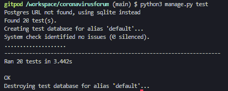

# Unit testing

For the forum app the following unit test were run on the forms, models and views

### 1. Testing forms

#### **Post form**

**Test 1 - Test_post_title_is_required**

Test the following conditions
- Form is not valid as title is blank
- There is a comment_body key in the dic
- There is an error message

**Test 2 - test_post_title_is_valid_with_data**

Test the following conditions
- Form is valid as title is contains characters
       
**Test 3 - test_body_is_not_required**

Test the following conditions
- Form is valid as title is contains characters and no body field
       
**Test 4 - test_postform_fields_are_explicit_in_form_metaclass**

Test the following conditions
- The fields are in meta
        

#### **Comment form**
    
**Test 5 - test_comment_body_is_required**

Test the following conditions
- Form is not valid as comment_body field is blank
- There is a comment_body key in the dic
 - There is an error message

**Test 6 - test_comment_body_is_valid_with_data**

Test the following conditions
- Form is valid as comment_body is contains characters

**Test 7 - test_commentform_fields_are_explicit_in_form_metaclass**

Test the following conditions
- The field is in meta
___       

### 2. Testing models 

**Test 8 - test_topic_str_method**

Test the following conditions
- tests the topic str method and verifies
    
**Test 9 - test_post_str_method**

Test the following conditions
- tests the post str method and verifies

**Test 10 - test_comment_str_method**

Test the following conditions
- tests the comment str method and verifies
    
**Test 11 - test_post_upvote_defaults_to_zero**

Test the following conditions
- tests the post default for upvote sets to zero and verifies

___

### 3. Testing Views

**Test 12 - test_get_homepage**

Test the following conditions
- that the status code is 200 and template used is index.html

**Test 13 - test_get_aboutuspage**

Test the following conditions
- that the status code is 200 and template used is aboutus.html

**Test 14 - test_get_talkguidelines**

Test the following conditions
- the status code is 200 and template used is talkguidelines.html
        
**Test 15 - test_get_privacypolicy**

Test the following conditions
- The status code is 200 and template used is privacypolicy.html
        
**Test 16 - test_get_list_of_posts**

Test the following conditions
- that the status code is 200 and  template used is postlist.html

**Test 17 - test_add_post_as_not_logged_in** 
(tests a user who is not logged in, can not create a post)

Test the following conditions
- if the page redirects to the home page
- if the message is the same as the not logged in user
- that the status code is 302  - redirect
        
**Test 18 - test_add_post_as_a_logged_in_user** 
(tests a logged in user can create a post)

Test the following conditions
- the post the user created is equal to title12
- if the message is the same as post submitted
- the status code is 302 - redirect
- redirected back to the postdetail page

**Test 19 - test_update_post_as_an_owner** 
(tests an owner of a post can update their post)

Test the following conditions
- the updated title equals the title that the user typed in.
- if the message is the same as post submitted
- that the status code is 302  - redirect
- redirected back to the postdetail page
        
**Test 20 - test_update_post_as_not_the_owner** 
(tests a user who has not created the post can not edit the post)

Test the following conditions
- a different user that try's to edit a post with the title field is not saved
- the updated title is not equals to the post title that the user typed in.
- that the status code is 304  - Not modified status code
___
## Results from tests        

