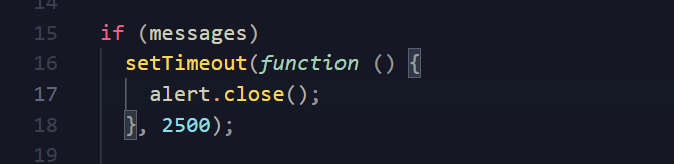
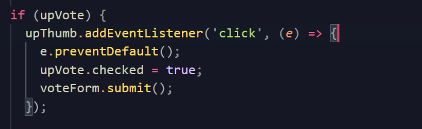
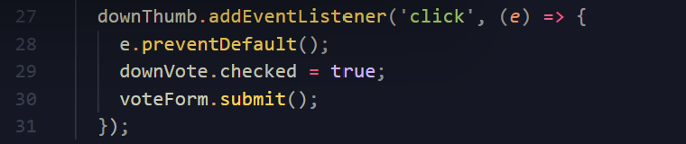

# Javascript manual testing
[Click here to go to the Readme file ](https://github.com/ccarabine/coronavirusforum/blob/main/readme.md#js-testing)

## Test 1 -Flash Message 

**Action** 
1. User logins in, navigates to a post and clicks on a thumb to vote
2. After 2500 ms

 

### **Test results**

Action|Expected result| Actual result| Status|
------------ | ------------ | ------------ |------------ |
|1.|Flash message displayed|[Result ](docs/images/testing/js_testing/test5_message_display.png)|Passed|
|2.|Flash message closes|[Result ](docs/images/testing/js_testing/test5_message_close.png)|Passed|

 

___

## Test 2 -upThumb selected

**Action** 
1. User clicks on upthumb

 

### **Test results**

Action|Expected result| Actual result| Status|
------------ | ------------ | ------------ |------------ |
|1.|upvote checkbox value is true|[Result ](docs/images/testing/js_testing/test1_upthumb_selected_r.png)|Passed|

 

___

## Test 3 -downThumb selected

**Action** 
1. User clicks on downthumb

 

### **Test results**

Action|Expected result| Actual result| Status|
------------ | ------------ | ------------ |------------ |
|1.|downvote checkbox value is true|[Result ](docs/images/testing/js_testing/test2_downthumb_selected_r.png)|Passed|

