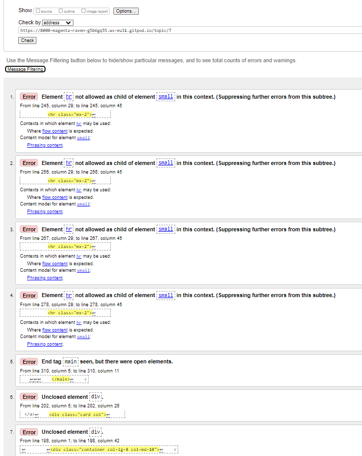
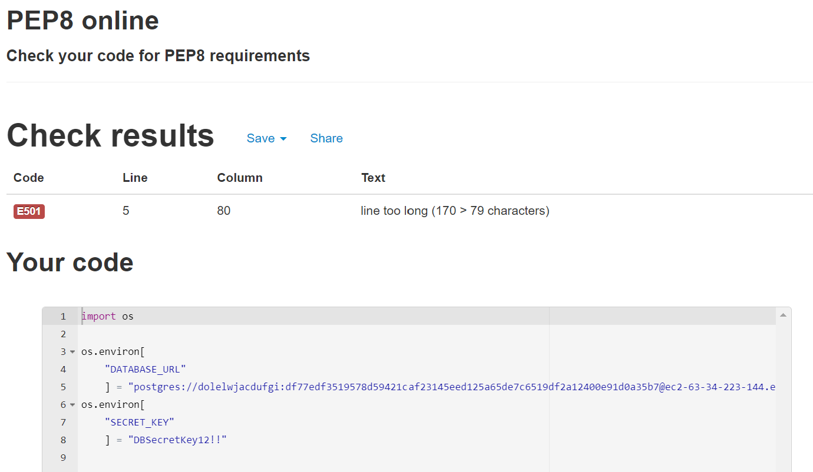

## Known issues during development </a>

[Click here to go to the Readme file ](https://github.com/ccarabine/coronavirusforum/blob/main/readme.md#known-issues)

### During development, the following issues were identified by user feedback and corrected

 - **Issue 1:** 
 
    *In production, summernote wysiwyg not displaying icons*

-	**Corrective Action:** 
    *Add header link and js and uploaded fonts to css*
    
    https://stackoverflow.com/questions/36034892/icons-not-showing-with-summernote-rails
    
    *Added configuration to cors in s3 bucket"*

Click here to view image 

___

- **Issue 2 :** 

    *On the latest statics page, when a user hovered over any data, the card would transform.  This confused the user thinking they would be able to click the card to take them to another page*

- **Corrective Action:** 

    *Removed card-post from the element*

___

- **Issue 3 :** 

    *I ran a test on the home page and got the following errors*
    "Bad value /topic/children and coronavirus for attribute on element a illegal character in path segment: space is not allowed"

Click here to view image 

- **Corrective Action:** 

    *Created a slug on the topic model, added it to the context dictionary and changed the template to refer to the element"*

Click here to view adding to context dictionary 

Click here to view template 

___

- **Issue 4 :** 

    *On all pages, the site was jumping when a user clicked on any links.  This was due to the row element going over 100% width*

- **Corrective Action:** 

    *I used unicorn sparkles to put a box around all elements and google chrome inspect tool to identify the element.*

    *row was adding 15px. To fix this issue i over rid row and set the margin right to zero*

___

- **Issue 5 :** 

    *When a user received a welcome email, the email is from "example.com"*

Click here to view image 

 

- **Corrective Action:** 

    *I changed the setting in setting.py site_id=2, this changed it to Coronavirus Forum*

Click here to view image 

   

___

- **Issue 6 :** 

    *When a user goes to a post and then clicks the topic title to go back to the list of posts by topic, a issue occurred.*

Click here to view image 

 

- **Corrective Action:** 

    *this was due to the link referring to the topic name which has spaces included.  Change link to post.topic.slug*

___

- **Issue 7 :** 

    *When a user, searched for a post, Header and post list is not formatted"*

Click here to view image 

- **Corrective Action:** 

    *Removed styling*
___

- **Issue 8 :** 

    *On a new comment page, the title is "Add **you** comment, change to add new comment page"*

Click here to view image 

- **Corrective Action:** 

    *Changed it to " Add **new** comment, change to add new comment page"*
___

- **Issue 9 :** 

    *On small devices talk guidelines link in the footer overflowed into privacy policy*

Click here to view image 

  

- **Corrective Action:** 
    *Adjusted grid setting for extra small devices up to medium so the social links would go to the next line"*

Click here to view image 

  

___

- **Issue 10 :** 

    *On inactive page, the following error displayed*

Click here to view image 

- **Corrective Action:** 
Took out extra apostrophe and reset base.html code
  

Click here to view image 

---

## Known issues during testing 

### HTML vaildation issues 

#### **Postlist**

Click here to view image 

- **Issue 1 :** 

    *Misuse of aria label*

- **Corrective Action:** 

    Removed aria-label

- **Issue 2,3,4 :** 

    *Element li not allowed as a child of element div in this context line*

- **Corrective Action:** 

    Moved the closing `ul` tag to the end to include all `li` items

___

#### **Postdetail**

Click here to view image 

- **Issue 1,2,3,4 :** 

    *Element hr not allowed as a child element small in this context*

- **Corrective Action:** 

    Moved hr element out of <small> element

- **Issue 5,6,7 :** 

    *Unclosed div elements*

- **Corrective Action:** 

    Closed 2 div tags

___

#### **Privacy policy**

Click here to view image 

- **Issue 1,2,3,4 :** 

    *li tag on line 64 didn't have a closing `>`*

- **Corrective Action:** 

    Closed li tag with a `>`

- **Issue 5,6 :** 

    *garbage after`</`*
     <h6>Types of Data Collected</6> tag not closed properly

- **Corrective Action:** 

    Corrected to </h6>

- **Issue 7,8,9,10,11 :** 

    *Element after li" cannot be represented as xml*

- **Corrective Action:** 

    Corrected from `<li"> to <li>`

- **Issue 12,13,14,15,16 :** 

    *End tag main seen, but there were open elements*

- **Corrective Action:** 

    Closed 4 div tags

___

#### **Sign in**

Click here to view image 

- **Issue 1 :** 

    *No p element in scope but a p end tag seen*

- **Corrective Action:** 

    Extra ending p tag

- **Issue 2 :** 

    *Element div not allowed as child of element ul in this context. (Suppressing further errors from this subtree.)*

- **Corrective Action:** 

    In  provider list changed divs to li tags

___   

#### **Sign up**

Click here to view image 

- **Issue 1,2 :** 

    *End tag main seen, but there were open elements*

- **Corrective Action:** 

   Closed div tag

___

#### **Social account login**

Click here to view image 

- **Issue 1,2 :** 

    *End tag main seen, but there were open elements*

- **Corrective Action:** 

   Closed div tag
   socialaccount_login

___

## CSS vaildation issues 

Click here to view image 

- **Issue 1 :** 

    *Value Error : background-color Parse Error var(-color-rich-black-fogra-29)*

- **Corrective Action:** 

    Remove background-color: var(-color-rich-black-fogra-29);

- **Issue 2 :** 

    *Value Error : overflow none is not a overflow value : none*

- **Corrective Action:** 

    Remove overflow;

___

## Wave accessibility vaildation issues 

#### **Post form**

Click here to view image 

- **Issue 1 :** 

    missing or uninformative page
    language missing or invalid
    

- **Corrective Action:** 

    They are included in the base.html
    `<html lang="en">`
    `<title>Corona Virus Forum</title>`
    
    The error may occur from not being signed in

___

#### **Post list**

Click here to view image 

- **Issue 1 :** 

    *5x empty links*
    

- **Corrective Action:** 

    Remove  
___

#### **Gov uk data**

Click here to view image 

- **Issue 1 :** 

    No label
    

- **Corrective Action:** 

    Added label

___

#### **Contact us**

Click here to view image 

- **Issue 1 :** 

    3 x missing form label
    
- **Corrective Action:** 

    Add aria labels

___

#### **About us**

Click here to view image 

- **Issue 1 :** 

    2 contrast errors on anchor tags
    

- **Corrective Action:** 

   Change anchor tags to blue

___

## JSHint validation issues 
#### **script.js**

Click here to view image 

- **Issue 1 :** 

    missing semicolons and undefined variables
    

- **Corrective Action:** 

   Added semicolons. defined upThumb, downThumb
   Add /*global bootstrap:false*/

___
   
## PEP8 validation issues 
#### **apps.py**

Click here to view image 

- **Issue 1 :** 

    expect 2 lines
    

- **Corrective Action:** 

   Added a line

___

#### **test_forms.py**

Click here to view image 

- **Issue 1 :** 

    2 issues of whitespace
    

- **Corrective Action:** 

   removed whitespace

   #### **env.py**

Click here to view image 

- **Issue 1 :** 

    database_url value to long
    

- **Corrective Action:** 

   added `# nopep8` to the end of the line
___

## Lighthouse validation issues 
#### **Accessibility home page mobile**

Click here to view image 

- **Issue 1 :** 
    Aria attributes do not match their roles
    
- **Corrective Action:** 
    Added aria label to mobile-search

___

#### **SCO -home page mobile**

Click here to view image 

- **Issue 1 :** 
    interactive elements - privacy policy link does not have enough space around them
    

- **Corrective Action:** 
    Added margin bottom to the links

___

#### **Performance Home page mobile**

Click here to view image 

- **Issue 1 :** 
    files size of images too big
    

- **Corrective Action:** 
    reduce file sizes

- **Issue 2 :** 
    i noticed carousel image 2 looked squashed
    
- **Corrective Action:** 
    Changed image

___

## Known issues during user story testing

- **Issue 1 :** 

    Mobile - on home page
    On the account dropdown, "change password" doesn't show on drop down menu

Click here to view image 

 

- **Corrective Action:** 

    Added code to mobile-top-header
___

- **Issue 2 :** 

    Mobile- on home page
    Search icon on the right, noticed whitespace on the right of it

Click here to view image 

 

- **Corrective Action:** 
    Inspected it with sparkles, and used inspect.
    Set padding-right to 0 on container-fluid

___

- **Issue 3 :** 

  Google Sign in - Button is not in container

Click here to view image 

 

- **Corrective Action:** 
    moved button with form-border class

___

- **Issue 4 :** 

    Account menu  - Logout instead of Sign out

Click here to view image 

 

- **Corrective Action:** 
    Change text to Sign out
___

- **Issue 5 :** 

    Change password fields not crispy in change password template

Click here to view image 

 

- **Corrective Action:** 
    added form crispy to form

___

- **Issue 6: :**

    Not logged in user, no link to "sign in to make a comment in comment section

Click here to view image 

 

- **Corrective Action:** 

    Added a criteria

___

- **Issue 7 :** 

User doesn't enter a search criteria and clicks enter, Topic header is empty, nothing displayed

Click here to view image 

 

- **Corrective Action:** 

    Add a criteria, if topic doesn't exist then display "No search criteria entered"

___

- **Issue 8 :** 

When a success message is displayed a small button appears after the message

Click here to view image 

Click here to view image 

 

- **Corrective Action:** 

    Removed button from alert message in base.html